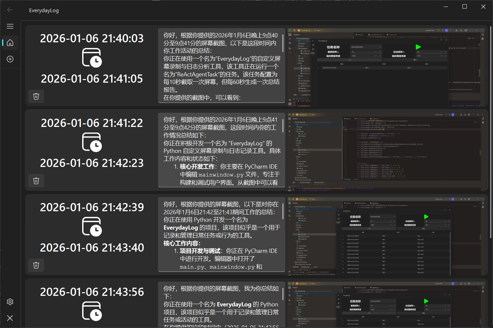
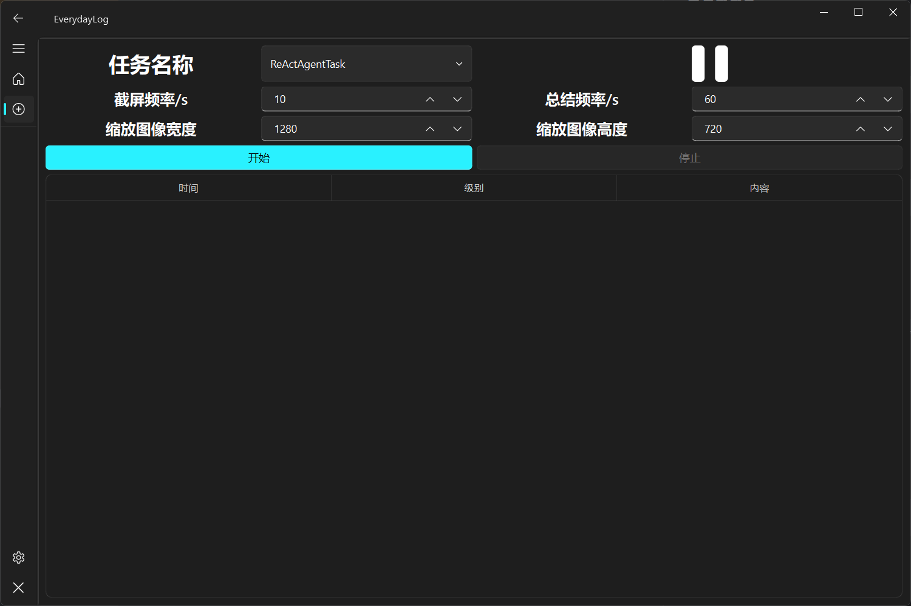

# EVERYDAY LOG


## Introduction
Daily computer operation logs based on agent and VLM.
It can automatically capture the current screen image at regular intervals and pass it on to the VLM for interpretation. It also records the daily computer operation logs.

## Usage
### Clone this repo
```bash
git clone https://github.com/joker20020/EverydayLog.git
```

### Install dependencies
```bash
uv sync
```

### Modify the configuration file
#### .env.example
- modify the value of `OPENAI_BASE_HTTP_API_URL`、`OPENAI_API_KEY`、`MODEL_NAME`
- rename to `.env`
#### data/config.example.toml
- rename to `config.toml`
- your can change its content by using the qt UI

### Run
```bash
uv run main.py
```

## Configure
```
-c --command-line # wether to run in command line mode
# The number of images to send to VLM = summary_freq // shot_freq
-s --shot-freq = 10 # screenshot frequency
-m --summary-freq = 60 # summary frequency(call VLM)
-f --force-size = (1280, 720) # force resolution
```

